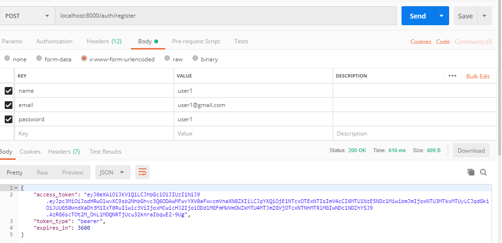
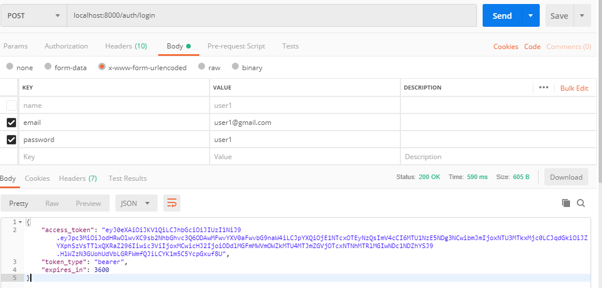
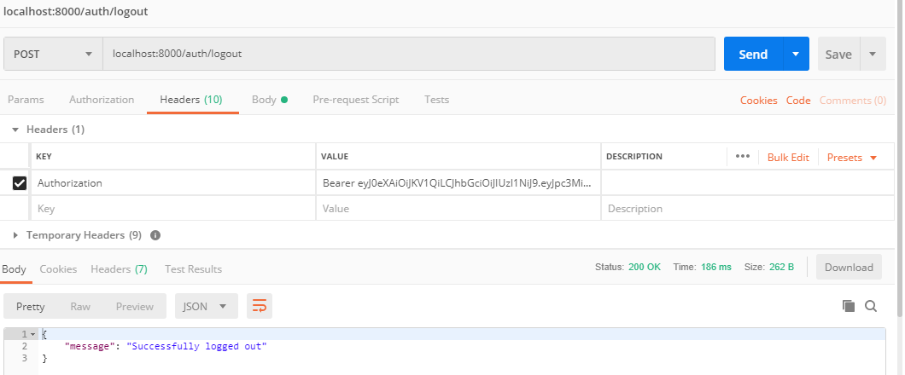
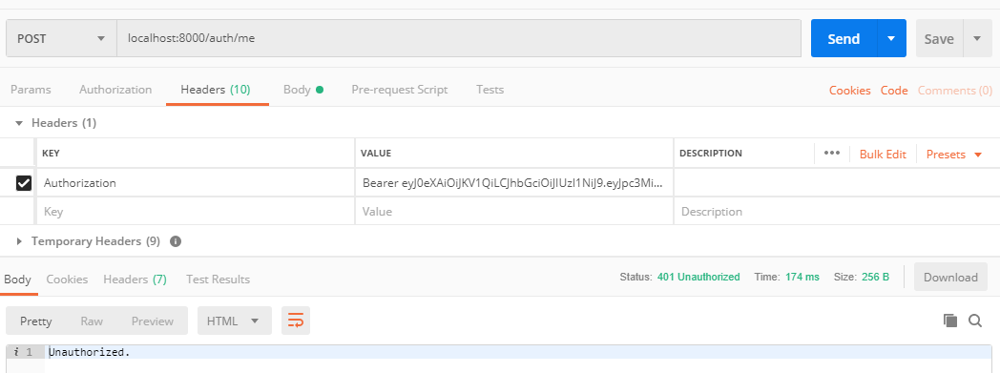

# jwt-auth

###### a Guide to use Tymondesigns JWT-Auth
You can read the guide from reference below, or just clone this repo. 
(the code in this repo is a little different than the official guide) 

## Lumen version 5.8 and tymon/jwt-auth 1.0.0-rc.4.1

1. clone this repo
1. add env file and configure your database
1. php artisan migrate and php artisan jwt:secret
1. see the routes/web.php, you can use postman and try
   1. register: 
   1. login: 
   1. check the authenticated user
   1. logout: 
   1. after logout 

### Reference From:
* https://jwt-auth.readthedocs.io/en/develop/lumen-installation/
* https://github.com/tymondesigns/jwt-auth/issues/1102#issuecomment-296785192
* https://medium.com/employbl/build-authentication-into-your-laravel-api-with-json-web-tokens-jwt-cd223ace8d1a
* https://github.com/tymondesigns/jwt-auth
